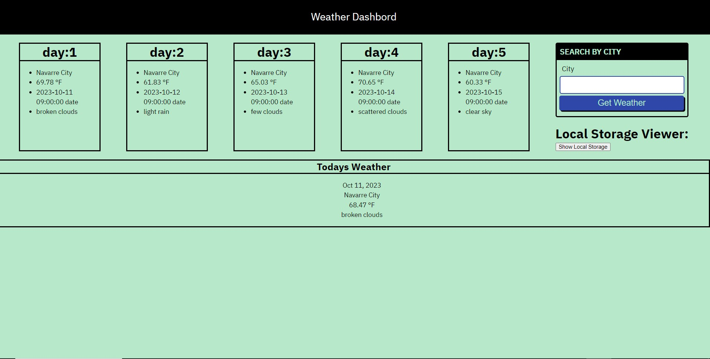

# Weather Forecast

## Description
This is a live Weather Forecast
In order for this Forecast to be live I used weather api for the functionality

### What did i do to insure that *Super duper cool live Weather Forecast* functioned properly
I linked my javascript objects using the dom
I appended javascript elements to my html
I linked everything properly

    